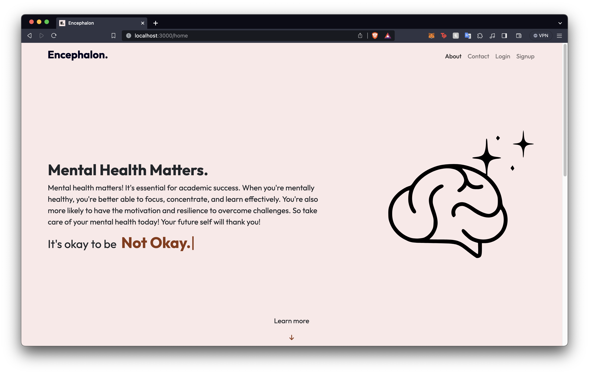

# Encephalon - Virtual Consultation Engine

Encephalon is a virtual consultation engine developed with the motivation to act as a first form of contact for students who feel like they are under too much pressure, stress, anxiety, or feel like their mental health is being neglected.

## Snapshot



## Setup

To get started with Encephalon, you'll need to follow these simple installation steps:

1. Install Node.js packages using npm:
   ```bash
   npm install

2. Install Python packages using pip:
   ```bash
   pip install -r requirements.txt

## Configuration

To configure Encephalon, make sure to set the following environment variables in your `.env` file:

```env
MAILUSER= Mail Trap Username
MAILPASS= Mail Trap Password
GOOGLE_CLIENT_ID= Firebase Client ID
GOOGLE_CLIENT_SECRET= Firebase Client Secret
EXPRESS_SECRET= Express Session Secret
OPENAI_API_KEY= Open AI API Key
MONGO_DB_URL= Mongo DB URI

## App Overview

Encephalon is designed to provide a user-friendly and intuitive interface for students seeking support for their mental health and well-being. The app offers the following functionality:

- **User Registration and Authentication:** Users can create accounts and securely log in to access the platform.

- **Questionnaire:** Users have access to a questionnaire that collects datapoints to provide a classification score and LLM diagnosis.

- **Support Request:** Users can get in touch with the Encephalon team by raising a support request through the contact section.


